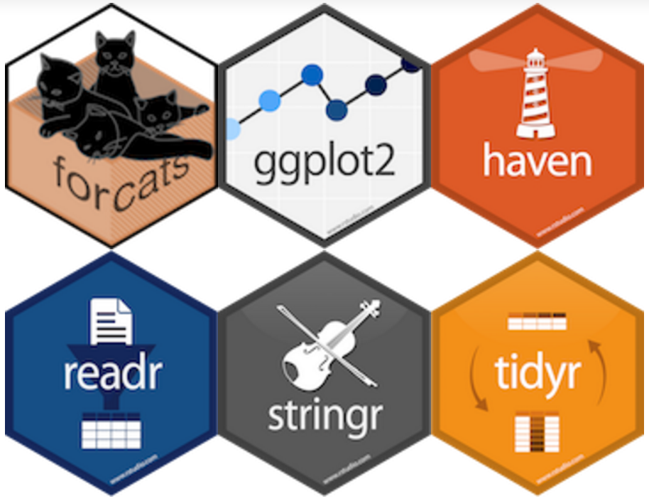
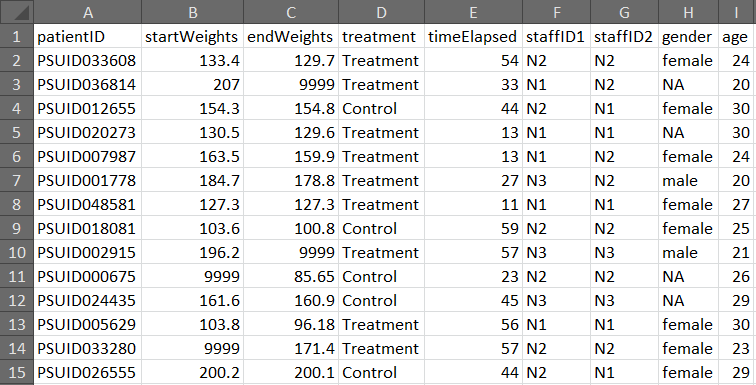
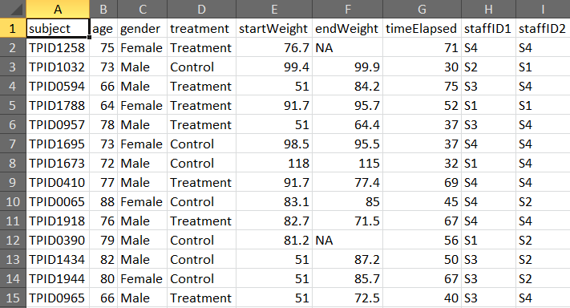
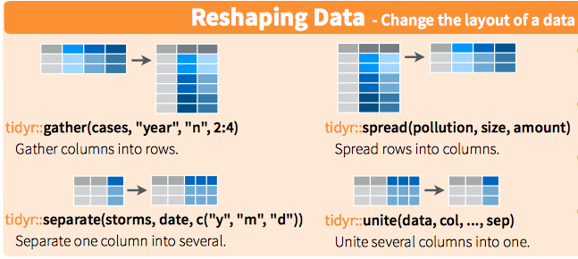

```{r}
knitr::opts_chunk$set(warning = FALSE, message = FALSE)
```

## Overview

  - What is Tidy Data?
  - A Simple Example: Going from Excel to Tidy Data to Plotting
  - The Tidyverse: Verbs for Data manipulation

## What is Tidy Data?

[According to Jeff Leek](https://leanpub.com/datastyle), tidy data has the following properties:

1. Each variable should have its own column.
2. Each observation of that variable should be in its own row
3. One table for each "kind" of variable (microarray data, sample table & demographics)
4. Multiple tables should have an identifier column to let you join them together.


## Why Tidy Data?

In short, most R packages expect tidy data in one form or another. 

Specifically: tidy data makes it easy to:

- Manipulate into different forms (reshaping/summarizing)
- Join with other tidy data
- Visualize
- Load into databases, etc.

Much of my time as an analyst is getting my data into a form that I can analyse.


## Tidyverse {.columns-2}

**Core Packages**

- `ggplot2` (graphics)
- `tibble` (data frames and tables)
- `tidyr` (make tidy)
- `readr` (read in tabular formats)
- `purrr` (functional programming)
- `dplyr` (manipulate data)



## How do we get it?

To get all the tidyverse packages, you can install it with a single command:

```{r eval=FALSE}
install.packages(tidyverse)
```

## Overall Workflow


We'll follow this workflow with a use case of reading in an Excel document,
cleaning it up, and visualizing it.

```{r Import tidyverse}
library(tidyverse) # Import tidyverse
```


## Read in Data


## Sample Dataset A




## Sample Dataset B




## Let's Read in the Data

```{r Read in data}
# Using the readxl package to read in Excel files
library(readxl)
rawData <- read_excel(path = "data/all_data.xlsx", # Path to file
                    sheet = 2, # We want the second sheet
                    skip = 1, # Skip the first row
                    na = "NA") # Missing characters are "NA"
```


## Take a Look at the Data

```{r}
head(rawData) # Tibble shows small bit of the data
```


## Another Way to Look at Data

```{r}
rawData
```

## The Tidyverse is all about verbs and pipes

Let's look at a typical tidyverse operation. 

```{r}
cleanData <- rawData %>%
  filter(gender == "Male") %>%
  mutate(diffWeight = startWeight - endWeight,
         weightChangePerDay = diffWeight / timeElapsed)
```

We'll take this apart bit by bit.

## Take a Look at the transformed data

```{r}
# We filtered for "Males" and "mutated" some data
cleanData
```

## Pipes let you go from start to finish

```{r, eval=FALSE}
# Reminder of what we did
cleanData <- rawData %>%
  filter(gender == "Male") %>%
  mutate(diffWeight = startWeight - endWeight,
         weightChangePerDay = diffWeight / timeElapsed)
```

The first thing to notice is the `%>%` character. This is called a "pipe" character. 

It lets you take the output of one function and make it the input of another function.

```{r, eval=FALSE}
cleanData <- rawData %>%
  filter(gender == "Male")
```

When you chain multiple functions together, you are building a **pipeline**.

## Some basic verbs for manipulating data

The nice thing about the tidyverse is that most of the functions are defined as verbs that you do to data.

- `filter()` - remove rows according to a criteria
- `select()` - select columns by name
- `mutate()` - calculate new column variables by manipulating data
- `arrange()` - sort data by columns

## `dplyr::filter()`

`filter()` lets you select rows according to a criteria. You can use `|` (OR) and `&` (AND) to chain together logical statements.

```{r message=FALSE}
filteredData <- rawData %>%
  filter(gender == "Male")

filteredData[1:4, ] # Filtered for just "Male"
```

How would we also filter the dataset for patients who had `startWeights` greater than 150?

Note that any statement or function that produces a boolean vector (such as `is.na(Species)`) can be used here.

## `dplyr::select()`

`select()` lets you select columns in your dataset. You can also rename them by passing in the new name as an equals statement:

```{r}

selectedData <- filteredData %>% 
  # Rename patientID to patient, select startWeight, endWeight, diffWeight
  select(patient=subject, startWeight, endWeight)

head(selectedData) 
```

## `dplyr::mutate()`

`mutate()` is one of the most useful dplyr commands. You can use it to transform data and add it as a new column into the `data.frame`.

```{r}
# Calculate a new variable based on other variables
mutatedData <- rawData %>%
  mutate(diffWeight = startWeight - endWeight)
mutatedData[1:4, ] %>% select(startWeight, endWeight, diffWeight)
```

## dplyr::mutate()

Once you've defined a new column with `mutate()`, you can use it just like any other variable:

```{r}
# Add a column with the same value for each entry
mutatedData <- mutatedData %>% mutate(site = "Site1") %>%
  mutate(weightLossPerDay = diffWeight / timeElapsed)

head(mutatedData)
```

## Chaining it all together with pipes

```{r}
cleanData <- rawData %>%
  filter(gender == "Male") %>%
  mutate(diffWeight = startWeight - endWeight,
         weightChangePerDay = diffWeight / timeElapsed)
head(cleanData)
```

## Summarizing Data

Now, we have clean data. How can we calculate summaries such as means and standard deviations by treatment?

```{r}
summarizedData <- cleanData %>% group_by(treatment) %>%
  summarize(meanLoss=mean(weightChangePerDay), sdLoss=sd(weightChangePerDay))

summarizedData
```

In order to do this we use two functions here: `group_by()` and `summarize()`. You can think of `group_by` as separating the data out into smaller data.frames (separated by the variable), and then with `summarize`, we perform an operation on them


## Start Exploring the Data!


## Look at data using ggplot2

Start with data set and `ggplot`, add "aesthetic mapping" and then more customization.

Aesthetic Mappings: Where you map visual properties to different variables in the data.

```{r}
cleanData %>% ggplot(aes(x = age, y = diffWeight)) + geom_point()
```


## More complex plotting

```{r}
cleanData %>% ggplot(aes(x = age, y = diffWeight,
                         color = treatment)) +
    geom_point()
```


## Let's look at differences in staff

```{r}
cleanData %>% ggplot(aes(x = age, y = diffWeight)) +
    geom_point() + facet_wrap(~ staffID1)
```


## Staff and treatment differences

```{r}
cleanData %>% ggplot(aes(x = age, y = diffWeight,
                         color = treatment)) +
    geom_point() + facet_wrap(~ staffID1)
```

## Where to go next?

Once you have tidy data, the world of R is your oyster. There's lots of ways to go from here.

- Many many more ways to plot/visualize - `ggplot2`
- Other ways to load tabular data (such as tab-delimited or csv files) - `readr`
- Reshaping data - `tidyr`
- Machine Learning (many many r packages)
- Interactive Visualizations (`shiny`)


## A Note on Reshaping Data

Oftentimes, you will need to change the format of the data. This might include:

  - Grouping multiple columns into a single column (`tidyr::gather()`)
  - Ungrouping a column into multiple columns (`tidyr::separate()`)
  - Taking rows and making them columns (`tidyr::spread()`)

The `tidyr` package is meant for these operations. We can't cover them all today, but they are covered on the cheatsheet. 



## Four Basic Principles to Tidyverse

1. Reuse existing data structures
2. Make simple function
3. Embrace functional programming
4. Design for humans

**Source**:

https://cran.r-project.org/web/packages/tidyverse/vignettes/manifesto.html

## Tidyverse Part 1

- `broom` (convert statistical objects to tidy data)
- `dplyr` (easily tidy data)
- `forcats` (work with categorical variables)
- `ggplot2` (create elegant data visualizations)
- `haven` (import and export SPSS, Stata, and SAS)
- `httr` (work with URLs and HTTP)
- `hms` (pretty time of day)
- `jsonlite` (robust JSON parser)
- `lubridate` (deal with dates easier)


## Tidyverse Part 2

- `magrittr` (pipe)
- `modelr` (modeling functions)
- `purrr` (functional programming)
- `readr` (read tabular data)
- `readxl` (read Excel data)
- `stringr` (manipulate strings)
- `tibble` (simple data frames)
- `rvest` (web scrapping tools)
- `tidyr` (easily tidy data)
- `xml2` (parse XML files)

## Resources

This tutorial has used these resources. If you're interested, we encourage you to read up and learn more! This is only the tip of the iceberg.

  - This tutorial: https://github.com/erictleung/tutorial-tidyverse
  - Hadley Wickham's paper on Tidy Data: https://www.jstatsoft.org/article/view/v059i10
  - Data Wrangling Cheatsheet: https://www.rstudio.com/wp-content/uploads/2015/02/data-wrangling-cheatsheet.pdf
  - An intro tutorial to ggplot2: https://github.com/laderast/ggplot2-intro
  - Data Visualization Class with Allison Hill, Steve Bedrick, Ted, and Jackie Wirz: http://cslu.ohsu.edu/~bedricks/courses/cs631/

- https://jennybc.github.io/purrr-tutorial/index.html
- https://github.com/tidyverse/tidyverse
- https://cran.r-project.org/web/packages/tidyverse/vignettes/manifesto.html
- http://docs.ggplot2.org/current/


## R for Data Science {.columns-2}

Website: http://r4ds.had.co.nz


## Questions?


# Principles of the tidyverse (for those who want to know)

## 1. Reuse existing data structures

1. **Reuse existing data structures**
2. Make simple functions
3. Embrace functional programming
4. Design for humans

- Re-use pre-existing data structures
- Many packages (e.g. ggplot2, dplyr) use rectangular data
- Use data frames or tibbles


## 2. Make simple functions

1. Reuse existing data structures
2. **Make simple functions**
3. Embrace functional programming
4. Design for humans

- The pipe character in R is `%>%`
- Functions should be "simple" and do one thing well
- Avoid mixing side-effects
    - Returns object OR
    - Side-effect i.e. changes the input data
- Function names should be verbs


## 3. Embrace functional programming


1. Reuse existing data structures
2. Make simple functions
3. **Embrace functional programming**
4. Design for humans

- R is a functional language
- Immutable objects == objects that don't change
- In other words, if you want to make changes, do a copy-on-modify
- Use tools that abstract out `for` loops e.g. apply methods or mapping


## 4. Design for humans

1. Reuse existing data structures
2. Compose simple functions with the pipe
3. Embrace functional programming
4. **Design for humans**

- Other people will read your code
- Be considerate of others reading your code
- Compute time is secondary to thinking time
- Things to do:
    - Invest time in good names
    - Be explicit and possibly long with names

